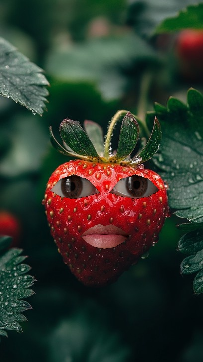
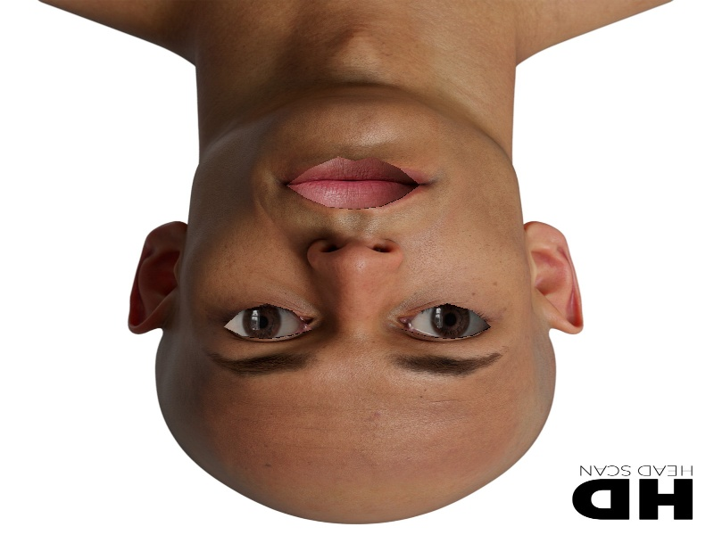

# Assignment 5

In this section, I created many projects on Face Alignment with OpenCV Library and Numpy Library

## Fruit Filter 

- 🍓 : Strawberry Snapchat Filter.\
    Just Fun!

## Rotate Picture
    
- 😵 Please Rotate The Image .... HOOOOOOOO!

## Face Alignment

- 🤪 ➡ 😛 : Find Eyes and then : BOOOOM! , Face in Direct  

## Big Eyes , Big Lip

- 👀 👄 : Just For Fun

---------------------------------------

## How to Install
Run Following Command : 
```
pip install -r requirement.txt
```
## How to Run
After Install , You can Run Following Command in Terminal to see the result :
```
python main.py
```
❗Important

you should be go to The Folder and Run that Command . Don't Forget it .

You Can Run This Command to Go the any Folder (Example : cd "Face Alignment"):
```
cd "folder-name"
```

In End , You Can Back to the Main Folder by Run this Command :
```
cd ..
```
## Result

### Fruit Alignment


### Rotate Picture


### Face Alignment


### EyeLipEnlarger
