# Assignment 6

In this section, I created many projects on Convolution and Histogram with OpenCV Library and Numpy Library

## Histogram

- 📊 I wrote a function that can calculate the histogram

## Foreground focus, Blur background 🌷
    
- Blur a Picture that have a flower

## Edge detection

- 2 Pictures for Edge Detection , 1.a Lion 2.a Spider
- Vertical and horizontal edge detection

## Noise reduction

- 3 Pictures for reduce noise . but result is not good . why?

---------------------------------------

## How to Install
Run Following Command : 
```
pip install -r requirement.txt
```
## How to Run
After Install , You can Run Following Command in Terminal to see the result :
```
python main.py
```
❗Important

you should be go to The Folder and Run that Command . Don't Forget it .

You Can Run This Command to Go the any Folder (Example : cd "Noise reduction"):
```
cd "folder-name"
```

In End , You Can Back to the Main Folder by Run this Command :
```
cd ..
```
## Result

### Histogram
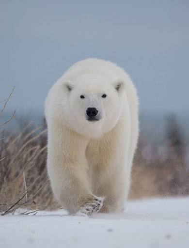
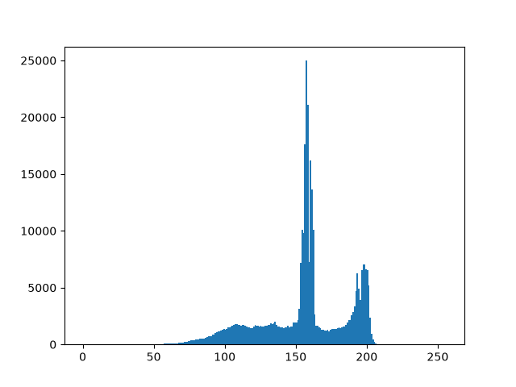
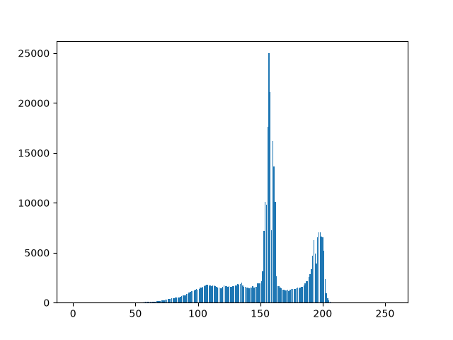
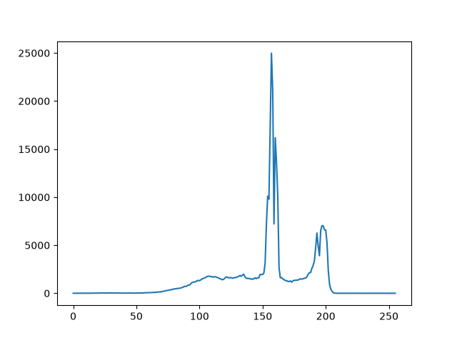

### Foreground focus, Blur background
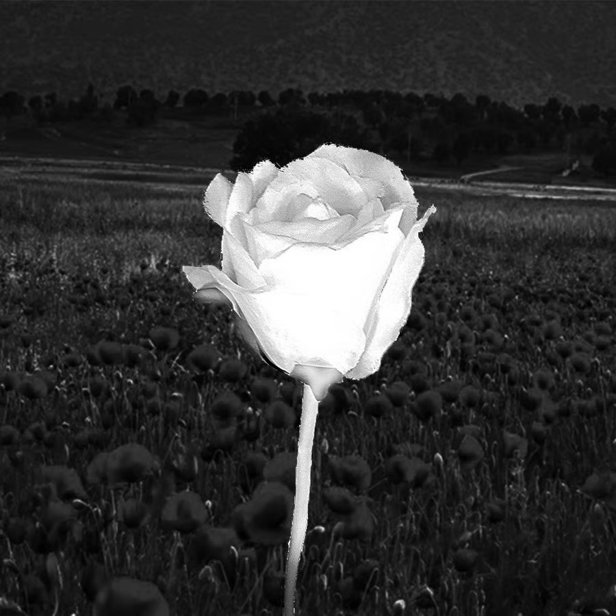
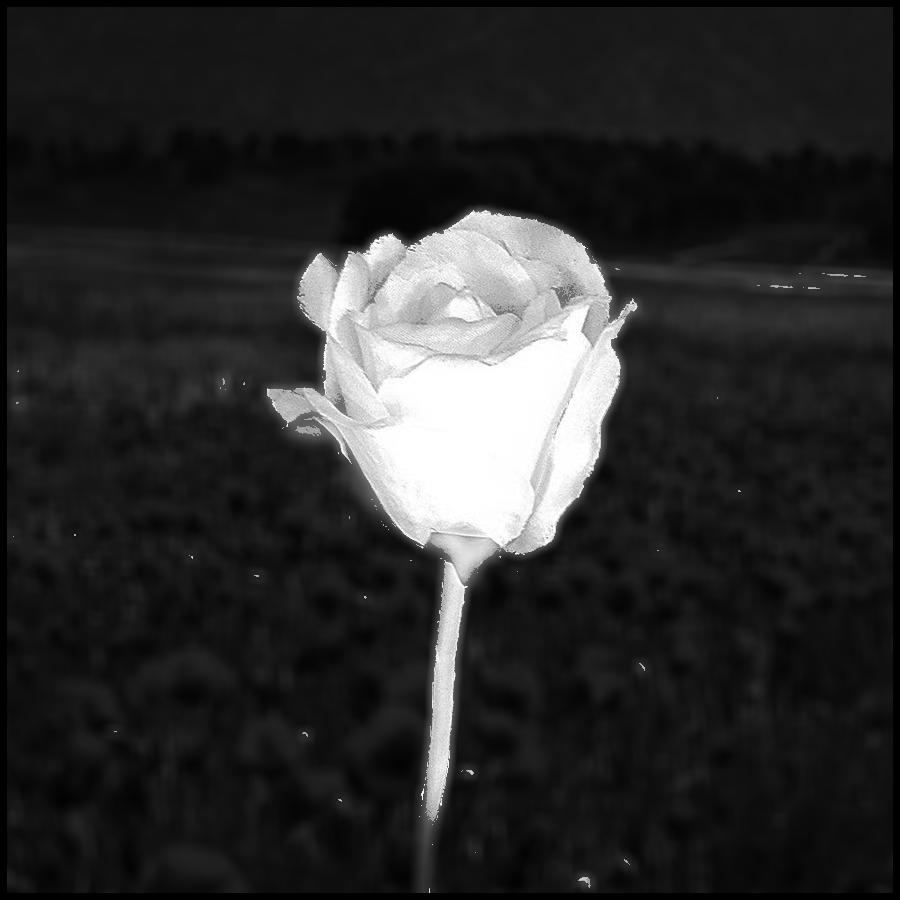

### Edge detection
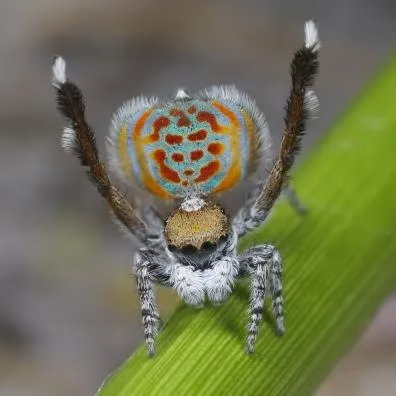
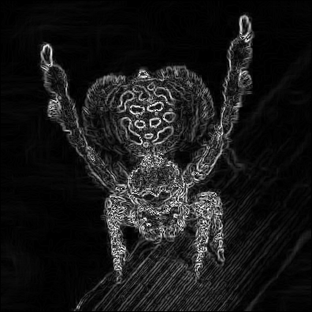

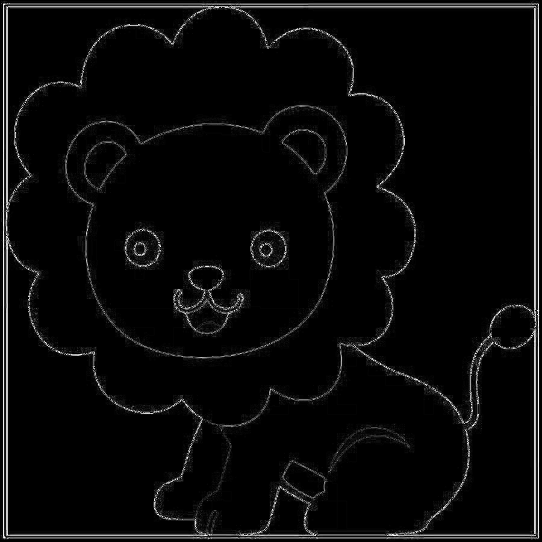
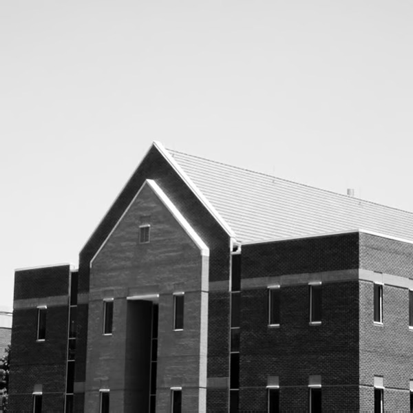
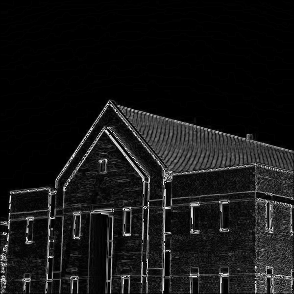

### Noise Reduction


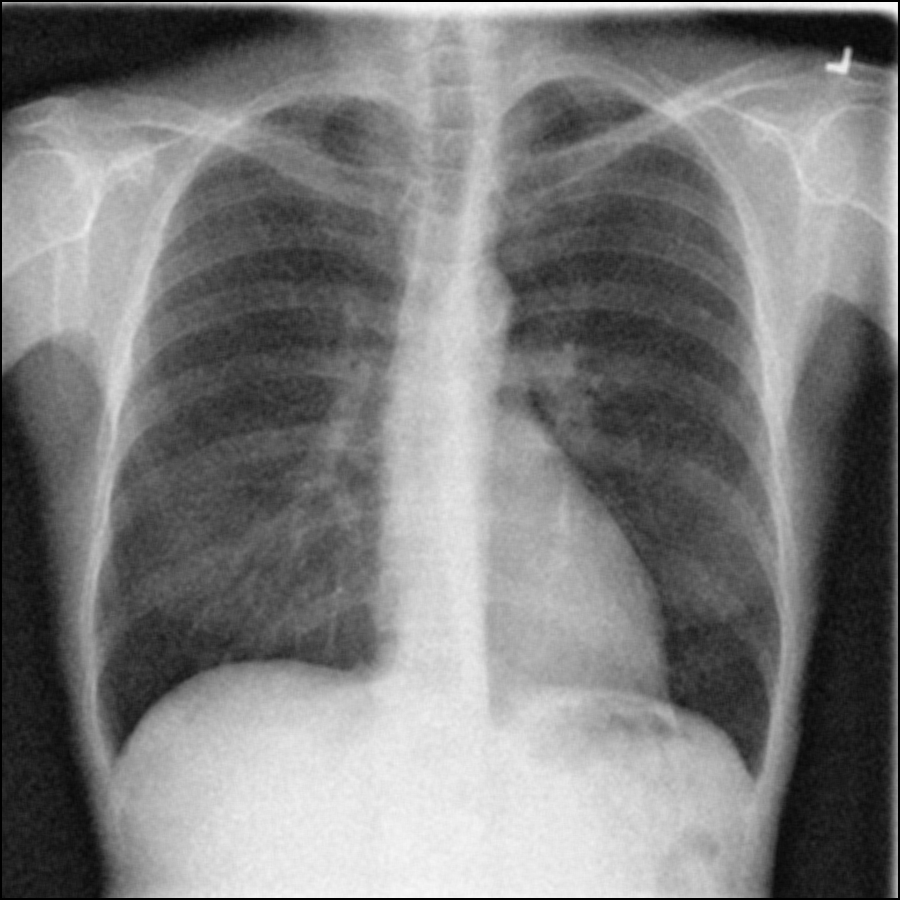

----------------------------------


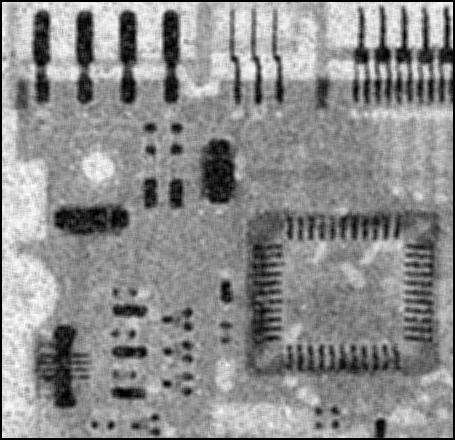
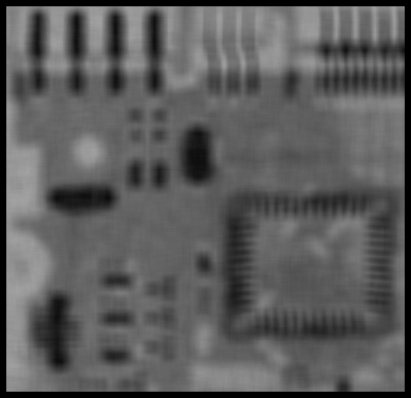
----------------------------------
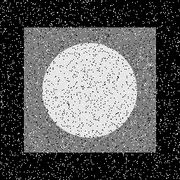
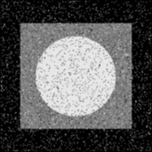
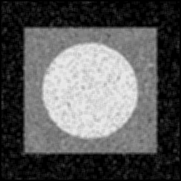
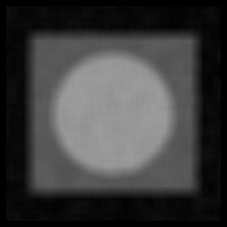