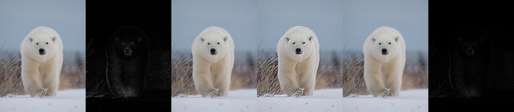
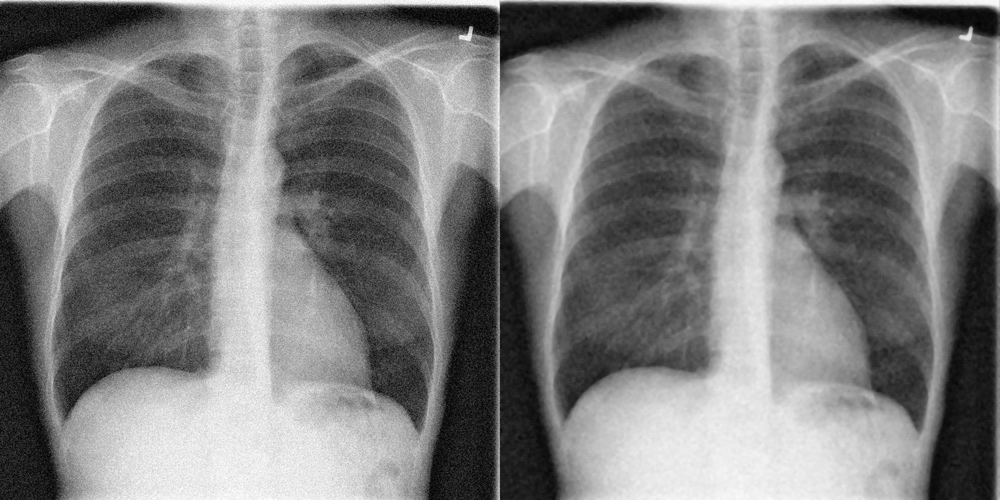
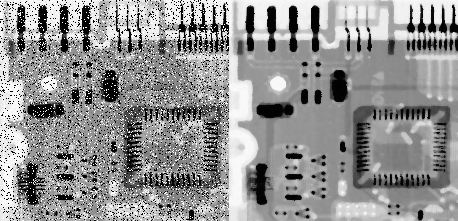
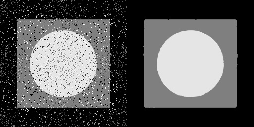
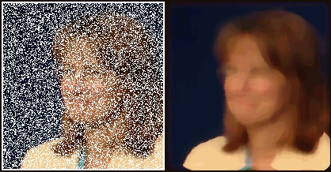
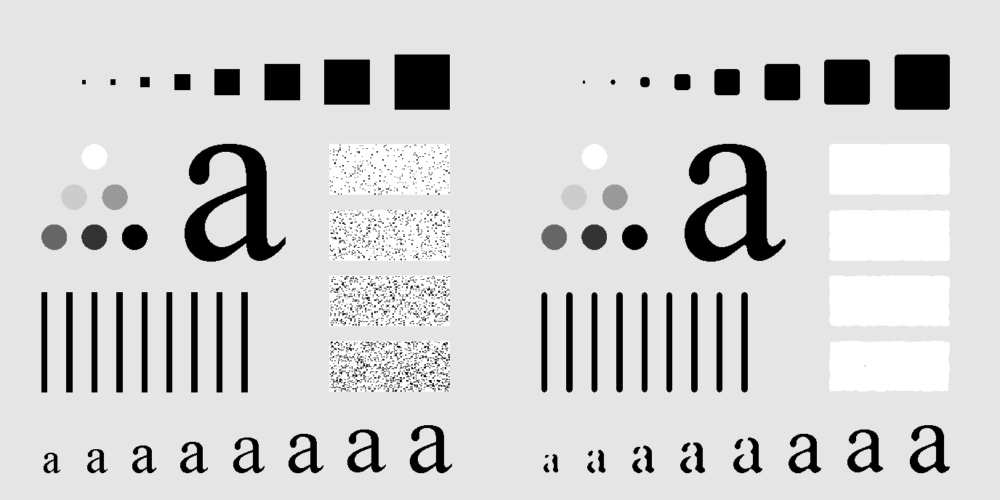
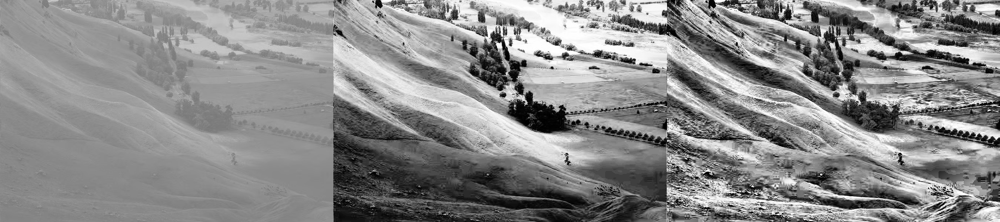
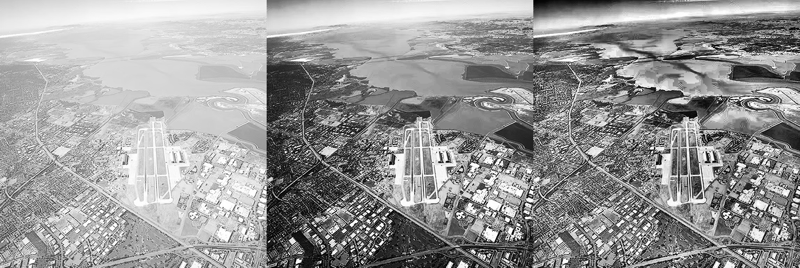
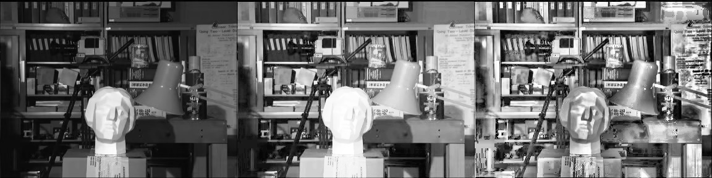

# Assignment 7

In this section, I created many projects on Convolution 2D and Histogram Equalization with OpenCV Library and Numpy Library

## Convolution 2D

- you can see my filters in an image . for more details please see the images in bellow page

## The Magic Image
    
- an image that show more details in hidden image 

## Median Filter

- remember last Assignment? I learn a new filter for better result

## Histogram Equalization

- woooow! look at the pictures! so beautiful 😍

---------------------------------------

## How to Install
Run Following Command : 
```
pip install -r requirement.txt
```
## How to Run
After Install , You can Run Following Command in Terminal to see the result :
```
python main.py
```
❗Important

you should be go to The Folder and Run that Command . Don't Forget it .

You Can Run This Command to Go the any Folder (Example : cd "Convolution2D"):
```
cd "folder-name"
```

In End , You Can Back to the Main Folder by Run this Command :
```
cd ..
```
## Result

### Convolution 2D


### The Magic Image


### Median Filter







### Histogram Equalization



