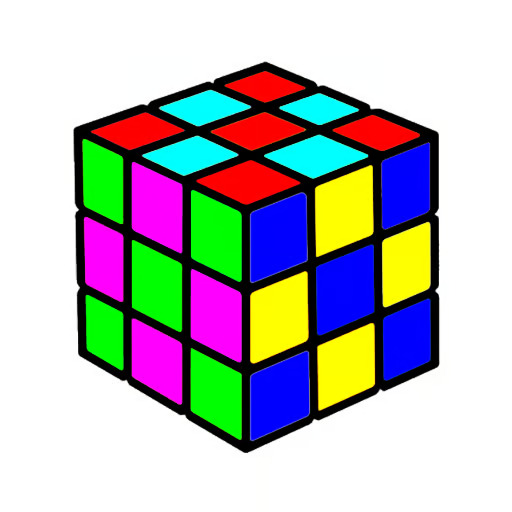
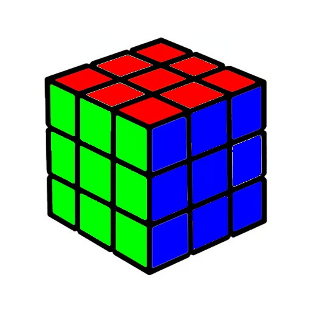
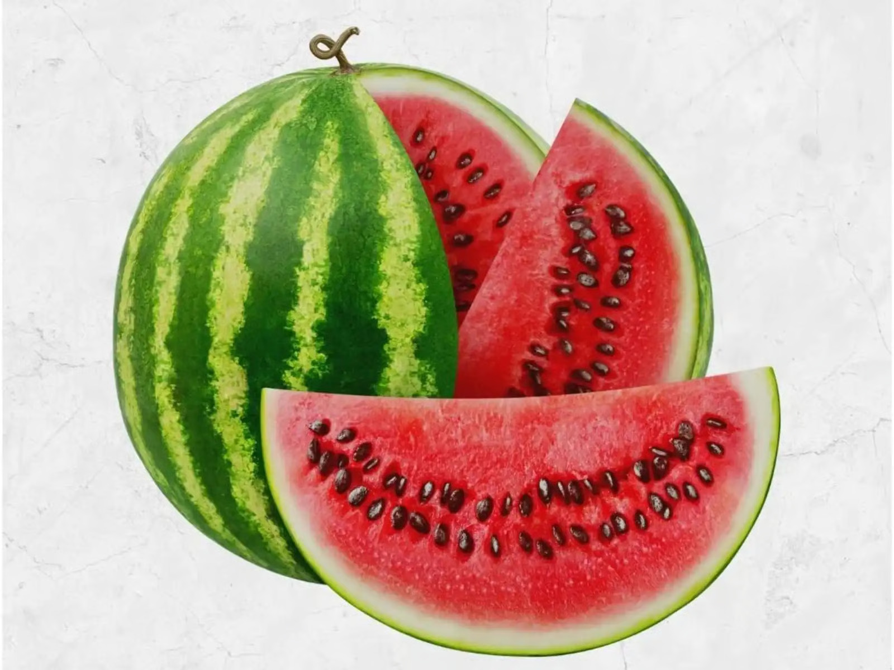
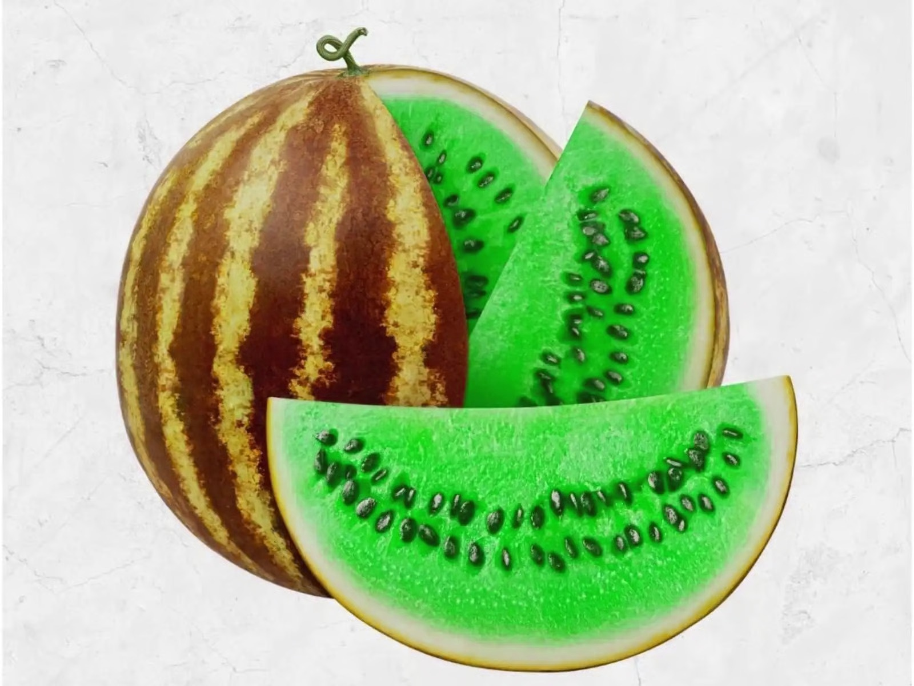

# Assignment 9

In this section, I created many projects on Digital Image Processing with OpenCV Library and Numpy Library

## Convert Color Image to Gray Image

- I Wrote a function that do this command

## Cube Solve
    
- see Input Image , I Can Solve it By Changing the colors , that's funny.

## Materwelon

- Do You Know the Matewelon? NO? Ok , so See the result Image.

## Rainbow Image

- a Beautiful Rainbow

## Microsoft Logo

- a Logo that you Know it !

---------------------------------------

## How to Install
Run Following Command : 
```
pip install -r requirement.txt
```
## How to Run
After Install , You can Run Following Command in Terminal to see the result :
```
python main.py
```
❗Important

you should be go to The Folder and Run that Command . Don't Forget it .

You Can Run This Command to Go the any Folder (Example : cd "Rainbow"):
```
cd "folder-name"
```

In End , You Can Back to the Main Folder by Run this Command :
```
cd ..
```
## Result

### Convert Color to Gray


### Cube Solve



### Materwelon



### Rainbow


### Microsoft Logo

